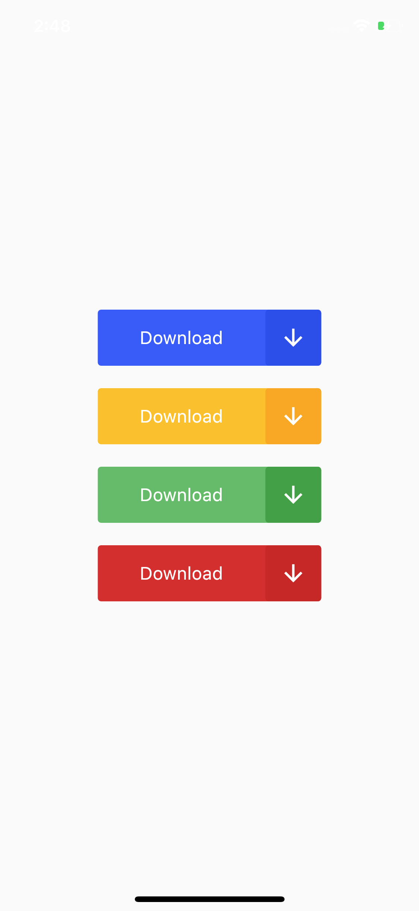
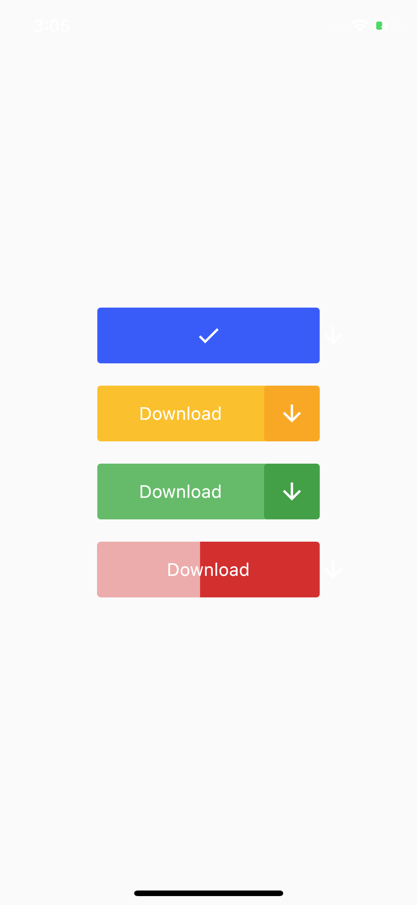

# Flutter Button Animation, Application Design - Day 7

Let's see how we can animate a button in Flutter.

[Youtube Video](https://youtu.be/WsbMf9IiWGo)

## Last Design
- [UI Design- Day 1](https://github.com/afgprogrammer/flutter-inspiration-app-ui)
- [UI Design- Day 2](https://github.com/afgprogrammer/Flutter-trip-app-ui)
- [UI Design- Day 3](https://github.com/afgprogrammer/Flutter-food-delivery-app-ui)
- [UI Design- Day 4](https://github.com/afgprogrammer/Flutter-actors-profile-app-ui)
- [UI Design- Day 5](https://github.com/afgprogrammer/Flutter-ripple-map-application)
- [UI Design- Day 6](https://github.com/afgprogrammer/Flutter-page-transition-animation)

## ScreenShot

&nbsp;

